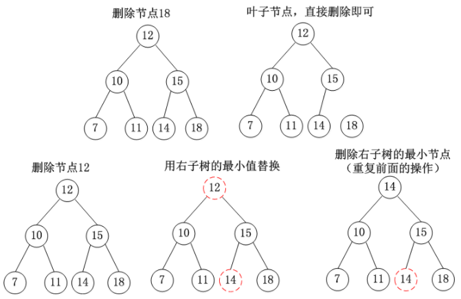

## 参考链接：
######  [https://www.cnblogs.com/skywang12345/p/3624343.html]  
##  红黑树的介绍
* 红黑树(Red-Black Tree，简称R-B Tree)，它一种特殊的二叉查找树。
* 红黑树是特殊的二叉查找树，意味着它满足二叉查找树的特征：任意一个节点所包含的键值，大于等于左孩子的键值，小于等于右孩子的键值。
* 除了具备该特性之外，红黑树还包括许多额外的信息。
* 
* 红黑树的每个节点上都有存储位表示节点的颜色，颜色是红(Red)或黑(Black)。
#### 红黑树的特性:
* (1) 每个节点或者是黑色，或者是红色。
* (2) 根节点是黑色。
* (3) 每个叶子节点是黑色。 [注意：这里叶子节点，是指为空的叶子节点！]
* (4) 如果一个节点是红色的，则它的子节点必须是黑色的。
* (5) 从一个节点到该节点的子孙节点的所有路径上包含相同数目的黑节点。
* 
* 关于它的特性，需要注意的是：
* 第一，特性(3)中的叶子节点，是只为空(NIL或null)的节点。
* 第二，特性(5)，确保没有一条路径会比其他路径长出俩倍。因而，红黑树是相对是接近平衡的二叉树。
* 红黑树示意图如下：  

#### 红黑树的Java实现(代码说明)
* 1.第一步: 将红黑树当作一颗二叉查找树，将节点插入。  
* 2.第二步：将插入的节点着色为"红色"。    
* 3.第三步: 通过一系列的旋转或着色等操作，使之重新成为一颗红黑树。  
* 红黑树的基本操作是添加、删除和旋转。在对红黑树进行添加或删除后，会用到旋转方法。为什么呢？道理很简单，添加或删除红黑树中的节点之后，
 红黑树就发生了变化，可能不满足红黑树的5条性质，也就不再是一颗红黑树了，而是一颗普通的树。而通过旋转，可以使这颗树重新成为红黑树。简单点说，
 旋转的目的是让树保持红黑树的特性。
* 旋转包括两种：左旋 和 右旋。下面分别对红黑树的基本操作进行介绍
* 左旋:逆时针旋转    当前节点的右孩子和父节点，逆时针旋转  
     
* 右旋:顺时针旋转   当前节点的左孩子和 父节点，顺时针旋转  
   
#### 节点插入 分类 
* 图片参考链接: [https://www.cnblogs.com/evasean/p/7998933.html]
* 插入一个红色的节点到红黑树中之后，会有6种情况：图示中N表示插入的节点，P表示父节点，U表示叔叔节点，G表示祖父节点，X表示当前操作节点
* case1  
  

* case4  

* case5-6  
  

* case2-3  
   

#### 删除操作 
* 第一步：将红黑树当作一颗二叉查找树，将节点删除。  
>  * 这和"删除常规二叉查找树中删除节点的方法是一样的"。分3种情况：
>  * ① 被删除节点没有儿子，即为叶节点。那么，直接将该节点删除就OK了。
>  * ② 被删除节点只有一个儿子。那么，直接删除该节点，并用该节点的唯一子节点顶替它的位置。
>  * ③ 被删除节点有两个儿子。  
>  * 那么，先找出它的后继节点； 然后把“它的后继节点的内容”复制给“该节点的内容”； 之后，删除“它的后继节点”。
>  * >  在这里，后继节点相当于替身，在将后继节点的内容复制给"被删除节点"之后，再将后继节点删除。
>  * >  这样就巧妙的将问题转换为"删除后继节点"的情况了，下面就考虑后继节点。 
>  * >  在"被删除节点"有两个非空子节点的情况下，它的后继节点不可能是双子非空。
>  * >  既然"的后继节点"不可能双子都非空，就意味着"该节点的后继节点"要么没有儿子，
>  * >  要么只有一个儿子。若没有儿子，则按"情况① "进行处理；若只有一个儿子，则按"情况② "进行处理。  

* 第二步：通过"旋转和重新着色"等一系列来修正该树，使之重新成为一棵红黑树。  
* 因为"第一步"中删除节点之后，可能会违背红黑树的特性。所以需要通过"旋转和重新着色"来修正该树，使之重新成为一棵红黑树。  
* 节点删除示意图:  
  
